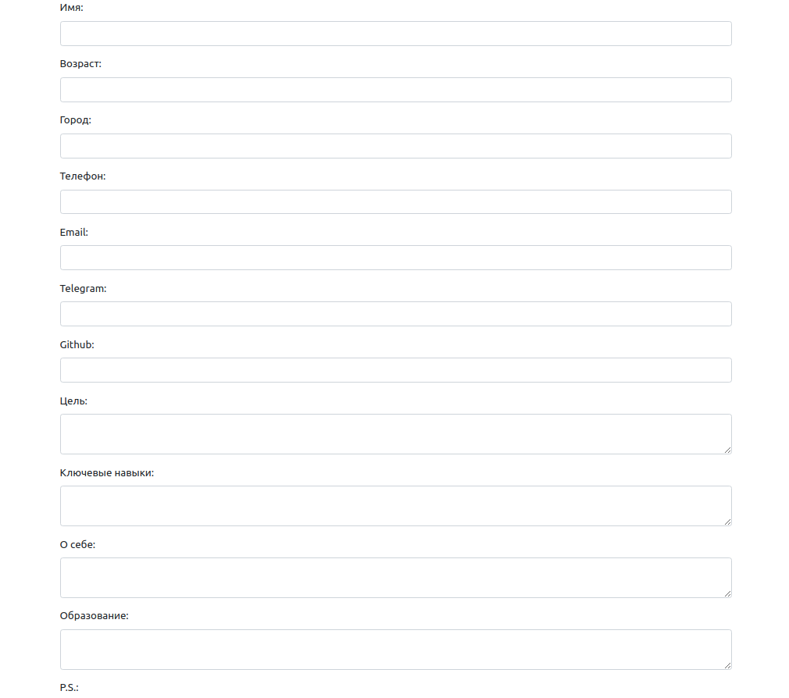
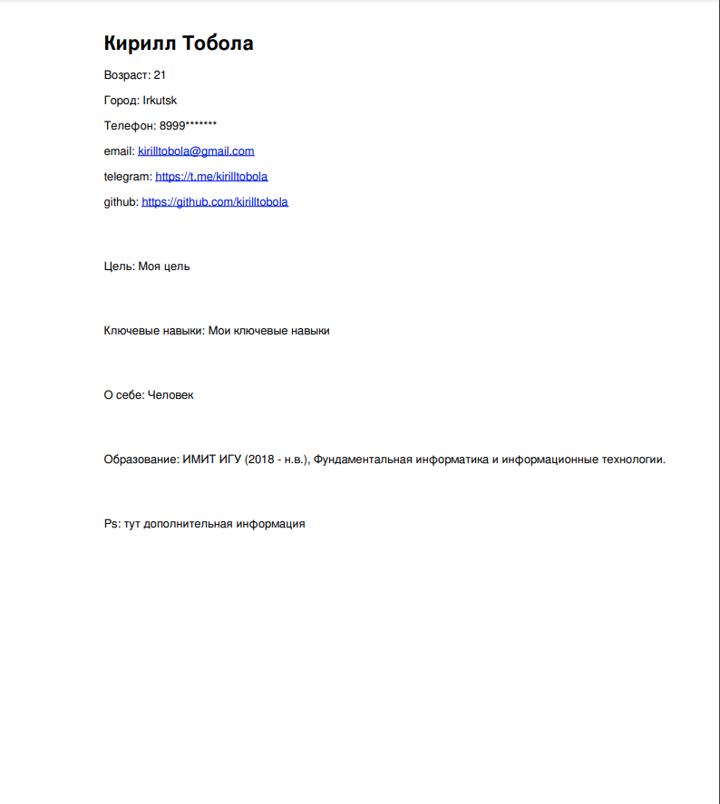

## CV Creator

### Приложение для создания резюме в формате pdf.

### Шаблон для оформления:
- Фамилия Имя
- Возраст
- Город
- Телефон
- Email
- Telegram
- Github
- Цель
- Ключевые навыки
- О себе
- Образование
- Ps

### Форма составления cv:

### Составленное резюме:

